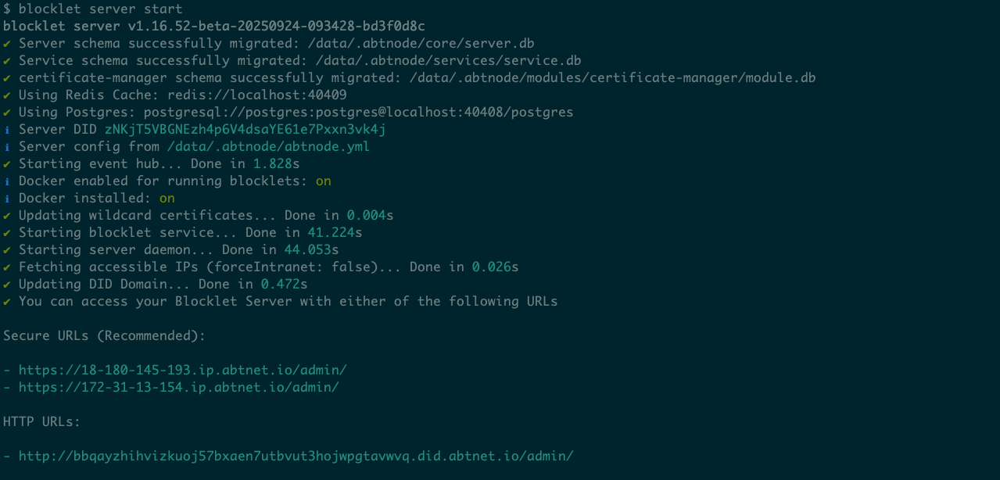
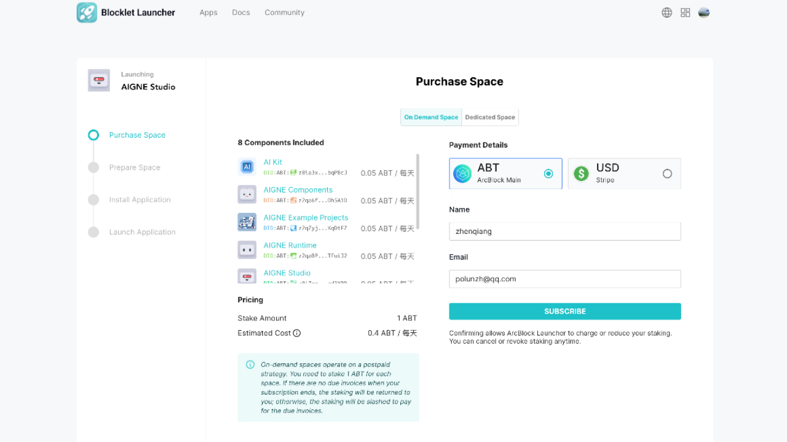
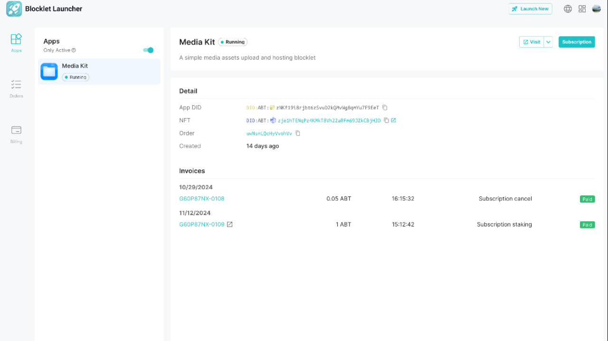
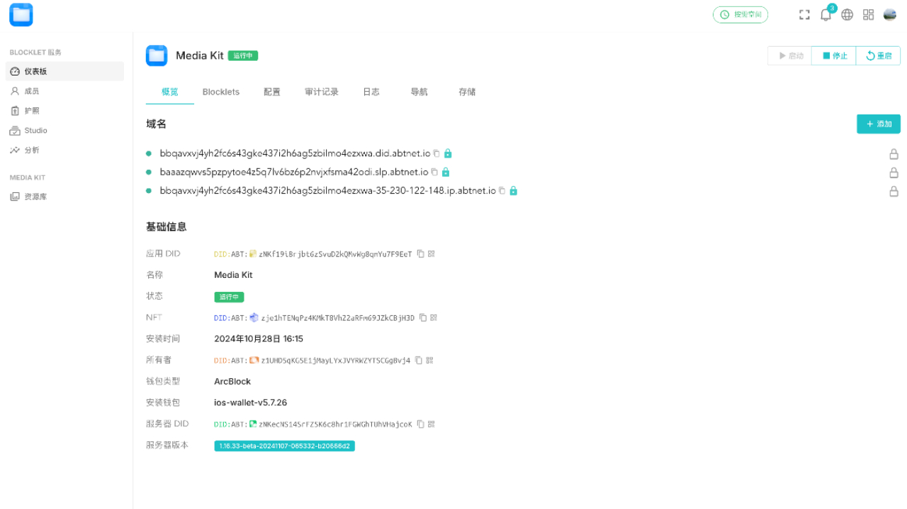

# Blocklet Platform Screenshots

This document provides a comprehensive overview of the Blocklet Server user interface, command-line tools, and blocklet service features through annotated screenshots.

## Blocklet Server

The Blocklet Server web dashboard provides a comprehensive interface for managing your blocklets, monitoring system performance, and configuring server settings.

### Store - Browse Blocklets

The official blocklet store interface where users can discover and install blocklets. Features a searchable catalog with categories including AI Agents, MCP Servers, Education, Extensions, and more. Each blocklet displays its name, description, publisher (ArcBlock), and download statistics. Popular blocklets shown include Media Kit, AIGNE Hub, Static Demo, AIGNE Studio, Discuss Kit, and Blockchain Explorer.

### Blocklets Management List

The blocklets management dashboard showing all installed blocklets in a table view. Displays key information including blocklet name with icon, visit links, uptime, installation date, last update time, and current status (Running/Stopped). Features an "Install New Blocklets" button for adding more applications. Includes blocklets like Demos, Shijun Store, Block Explorer, Game Console, AIGNE Hub Debugger, and Community Playground.

### Blocklet Server Logs View

A terminal-style log viewer displaying real-time server logs and debugging information. Shows detailed logging output with timestamps, log levels (info, debug, warn), and system events. Essential for troubleshooting and monitoring blocklet operations, with color-coded entries for different log types.

### Team Members Management

The team management interface with tabs for Members, Passports, Access Keys, and Audit Trail. Shows all team members with their roles (Owner, Admin, Member, Guest), DID addresses, last login times, IP addresses, and registration source. Features "Invite New" and "Transfer Ownership" buttons. Members are authenticated via DID wallet with detailed activity tracking.

### Analytics - Runtime Dashboard

A comprehensive analytics dashboard with two tabs: Traffic and Runtime. The Runtime tab displays real-time system metrics including CPU usage (29%), Memory (8.01 GiB, 25%), Daemon Memory (373.38 MiB, 9%), and Service Memory (498.22 MiB, 48%) with trend graphs. Shows disk usage (402.01 GiB, 87% used) and a detailed breakdown table listing all running services with their uptime, memory usage, CPU usage, runtime environment (Node.js), process IDs, and ports.

### Settings - Basic Configuration

The basic settings page with tabs for Basic, Domains & URLs, SSL Certificates, Gateway, Integrations, and About. Allows users to configure server name ("Debug Server"), description, Blocklet Launcher URL, NFT Domain URL, and DID Wallet URL. Includes toggle switches for features like Auto Update Check, Enable Beta Release, Welcome Page, Enable Session Hardening, File System Isolation, Run Blocklets in Containers, and Container Network Isolation.

### Settings - Gateway Configuration

Advanced gateway configuration page with options for Gateway Cache (boost performance), Request Limiting (concurrent request limiting), Request Blocking (protect from bad requests), Proxy Policy (running behind proxies), and Web Application Firewall with ModSecurity integration. Features adjustable sliders for inbound and outbound anomaly score thresholds and log level configuration. The mode dropdown shows "On (will block requests)" option with a link to ModSecurity documentation.

### Settings - About & Upgrade

The About section displaying server information including version (1.16.51), Node DID, Owner DID, Routing Engine (nginx@1.27.0), Database (SQLite@3.44.2), Operating System (darwin, arm64, 24.0.0), Node.js version (22.14.0), and Bun (1.2.18). Shows available upgrade to version 1.16.52-beta with an "Upgrade" button, plus options to restart the server, restart all blocklets, clear cache, and rotate session salt for enhanced security. A notification banner indicates an upgrade is available.

## Blocklet CLI

The Blocklet CLI provides powerful command-line tools for managing both individual blocklets and the Blocklet Server itself.

### CLI - Main Commands Help

The main help screen for the `blocklet` CLI tool showing all available commands. Includes options for version display (-V, --version), automatic yes to prompts (-y, --yes), and help (-h, --help). Commands cover the full blocklet lifecycle: bundle, deploy, dev, test, init, meta, version, upload, exec, debug, connect, create, component, add, remove, cleanup, document, config, server, and help. Each command includes a brief description of its functionality.

### CLI - Server Commands Help

Detailed help for the `blocklet server` command showing options (-V for version, -c for config file, -y for automatic yes, -h for help) and available subcommands: start, init, status, logs, stop, info, cleanup, migrate, nginx, and upgrade. Each command is explained with its purpose, from starting the server to managing database migrations and nginx configuration. Includes a helpful note about the command line utility at the bottom.

### CLI - Server Status Output

Output of `blocklet server status` command displaying comprehensive server information including version (v1.16.52-beta), Server DID, config file location, Docker status (enabled and installed), server status (Running for 6d 17h 27m), mode (Production), data directory, router engine (nginx@1.28.0), and database (PostgreSQL@17.5). Shows a list of blocklets with their names, status (stopped/running), and URLs with DID addresses. Fetch operation completed in 0.304s.

### CLI - Server Info Output

Detailed output of `blocklet server info` command showing extensive server configuration including version, Server DID, binary path, config file, router provider (nginx), HTTP/HTTPS ports (80/443), host CPU (4/8 cores), memory (29.92 GiB / 30.64 GiB), host IP addresses (internal and external), server domain status (correct), Docker status, file system isolation (off), and system information including OS (Linux 6.1 Amazon Linux 2023), CPU (x64 AMD EPYC 7R13), shell (zsh), binaries (Node 22.16.0, npm 10.9.2), servers (Nginx 1.28.0), and virtualization (Docker 25.0.8).

### CLI - Server Start Output

Terminal output from `blocklet server start` command showing the server startup sequence. Displays successful schema migrations for server, service, and certificate-manager modules, Redis and PostgreSQL connection strings, Server DID, config file path, event hub startup (1.828s), Docker status, wildcard certificate updates, blocklet service startup (41.224s), server daemon startup (44.053s), IP address fetching, and DID Domain updates. Concludes with both secure (HTTPS) and HTTP URLs for accessing the Blocklet Server admin interface.

## Blocklet Service

The Blocklet Service interface (AIGNE Hub) provides advanced features for managing blocklets within a production environment, including multi-blocklet coordination and service-level configurations.

### Service - Blocklets Overview

The AIGNE Hub blocklets overview showing the Blocklets tab with 3 running blocklets: AIGNE Hub (0.4.38 at /ai-kit/), Media Kit (0.13.31 at /image-bin/), and Payment Kit (1.21.3 at /payment-kit/). Also displays AIGNE Observability (not installed) and two redirect configurations. Features "Check For Updates" toggle, Start/Stop/Restart buttons, and an "Add Blocklet" dropdown. The sidebar shows sections for Dashboard, DID Connect, AIGNE Hub, Website, Operations, Integrations, Developers, DID Spaces, Studio, Media Gallery, Payments, and Integrations.

### Service - DID Connect Members

The DID Connect members management interface showing tabs for Members, Passports, Settings, Security, and OAuth Apps. Displays all members (7385 total) categorized by role: Owner (1), Admin (19), Member (0), Guest (0), and various subscriber types (Bookmark Subscriber, Doc Subscriber, Discussion Subscriber, Blog Subscriber, Prompts Editor, Pages Editor, Blog Editor). Each member entry shows their name, DID address, last login time, last login IP, registration source (DID wallet/Email/Google federated), active user sessions count, and action menu. Features "Show Approved Only" filter, "Inviting" status indicator, and "Invite New" button.

### Service - Website Domains

Website domain management interface with tabs for Domains, Branding, Theming, and Navigation. Allows users to purchase new DID domains or configure existing ones. Shows "My Domains" section with configured domains (www.aikit.rocks and hub.aigne.io) with verification checkmarks. Below that is a "Default Domains" section showing automatically assigned development domains that are not intended for production use.

### Service - Website Branding

The Branding configuration page for AIGNE Hub where users can set basic website information including App Name (used in DID Connect, browser tabs, website footer, SEO), App Description (for SEO and OpenGraph), App URL (https://hub.aigne.io for sitemap and social sharing), Copyright Owner and Year (for website footer). Features a Visual Information section for uploading App Logo (512\*512 pixels) with preview for both Light Mode and Dark Mode. Supported languages shown are English and 简体中文 (Simplified Chinese).

### Service - DID Spaces Backup

DID Spaces management interface showing Connected DID Spaces with "Team Backup" connected (indicated by green status), Auto backup toggle enabled, and "Connect to DID Spaces" button. Displays a visual Backup records heatmap showing backup activity across months (Nov through Oct) with color-coded indicators for backup status (failed, without backup, succeeded). Below is a detailed table of backup records showing DID Space, Strategy (Auto), Start time, End time, and Status (all Succeeded) with pagination showing 1-10 of 3316 records.

### Service - Operations Analytics

Comprehensive analytics dashboard with tabs for Notifications, Analytics, Audit Trail, and Advanced. The Analytics tab displays trend charts from Sep 1-30, 2025, showing multiple metrics: Total Requests (53579), Success Requests (53565), Failed Requests (26), Unique Visitors (433), Unique URLs (1405), Unique Referrers (209), Unique 404 errors, Unique Static Files (426), and Log Size (16.83 MiB). All metrics are visualized with time-series graphs showing daily patterns and fluctuations over the selected period.

### Service - Operations Logs

The Operations Logs viewer showing tabs for Logs, Performance, and Docs. Displays real-time HTTP access logs for the Payment Kit blocklet with filtering options (Error, Info, Access, debug, other). The log view shows detailed HTTP request information including timestamps, status codes (200), request methods (GET/POST), URLs, response times, file sizes, user agents, and IP addresses. Each log entry is color-coded and formatted for easy readability, essential for debugging and monitoring blocklet traffic patterns.

### Service - Add Blocklet Modal

A modal dialog for adding blocklets to AIGNE Hub with a multi-step wizard (Select Blocklet → Introduction → Install). Shows the Official Store with search functionality, extension/free filters, and popularity sorting. Displays blocklet cards including Media Kit, AIGNE Hub, Static Demo, AIGNE Studio, Discuss Kit, Blockchain Explorer, NFT Store, Pages Kit, NFT Blender, Coming Soon Page, NFT Maker, and Static Server. Each card shows the blocklet icon, name, verified badge, description, and download count. Features "Detail" buttons for more information.

### Service - Blocklet Environments

Environment variable configuration dialog for Payment Kit showing editable environment variables. Displays current variables including SHORT_URL_API_KEY, SHORT_URL_DOMAIN (s.aigne.io), PAYMENT_DAYS_UNTIL_DUE (1), PAYMENT_BILLING_THRESHOLD (1), and PAYMENT_CHANGE_LOCKED_PRICE (1). Each variable has edit and delete icons. Features an "Add" button (+) at the top for adding new environment variables. Note indicates that changes take effect when the application is running and requires restart.

### Service - Blocklet Preferences

Preferences configuration for Media Kit showing various settings. Includes Supported Media Types Extensions (.jpeg, .png, .gif, .svg, .webp, .bmp with detailed help text), Maximum File Upload Size (2MB with validation rules), Hotlink Protection toggle (Beta feature to restrict access to trusted domains), Use AI Image toggle (for generating images using AI), and Supported Models section with a text area for specifying AI models using comma-separated values and wildcard patterns (e.g., dall-e-2, gpt-\*). Features a "Save Changes" button at the bottom.

## Blocklet Launcher

### Purchase Space Subscription

This screenshot shows the space purchase flow where users can subscribe to on-demand or dedicated hosting space for their blocklet applications. The interface displays the AIGNE Studio application being launched, with 8 components included in the subscription package (AI Kit, AIGNE Components, Example Projects, Runtime, and Studio). Users can select their preferred payment method (ABT tokens or USD), enter their details, and configure staking amounts. The on-demand pricing model requires 1 ABT stake per space, with automated staking returns when subscriptions end.

### App Details and Invoices

This screenshot displays the application detail page for the Media Kit blocklet in running status. The interface shows comprehensive application information including the App DID, NFT identifier, and order reference. The invoices section lists subscription-related transactions with timestamps, amounts in ABT tokens, and payment status indicators. Users can access the running application via the "Visit" button and manage subscription settings. This view provides transparency into billing history and application metadata for active blocklets.

### App Overview and Domains

This screenshot presents the Chinese-language view of the Media Kit application overview tab, focusing on domain management and basic information. The interface displays configured domain names and DNS records for accessing the deployed blocklet. Key technical details are shown including the application DID, NFT identifier, installation timestamp (October 28, 2024), owner information, blockchain type (ArcBlock), wallet version (ios-wallet-v5.7.26), and consumer DID. The navigation sidebar provides access to different sections like settings, billing, Studio, and analytics for comprehensive application management.

## Blocklet Store

### Explore Trending Blocklets

The Explore page serves as the main discovery interface for the Blocklet Store, featuring a featured carousel highlighting popular blocklets like AIGNE Studio (a no-code generative AI apps engine), and a "Trending" section below showcasing popular blocklets such as Media Kit, NFT Store, Pages Kit, and Discuss Kit. The left sidebar provides category filtering options including Photos, Accessibility, Blog, Communication, Entertainment, News & Weather, Productivity, Search Tools, Shopping, Sports, Developer Tools, and more, enabling users to browse blocklets by specific use cases.

### Blocklet Catalog Grid

The catalog view displays all available blocklets in a clean grid layout, showing each blocklet with its icon, name, verified badge, brief description, publisher information (ArcBlock), and download/usage statistics. Users can filter by free blocklets and sort by "Most Popular" to discover widely-adopted solutions. Featured blocklets include Media Kit (88.6k), NFT Store (24.4k), Pages Kit (21.6k), Discuss Kit (18.0k), AI Kit (17.0k), Search Kit (16.5k), Payment Kit, and NFT Blender, each with a "Launch" button for quick deployment.

### Blocklet Detail Overview

The detail page for the Blocklet Store itself provides comprehensive information including the blocklet's logo, title, description ("Decentralized store for blocklets"), publisher (ArcBlock), download count (394), and support badge. Key metadata is displayed prominently: Category (Productivity), Version (0.14.20), and Package size (14.16 MB). The page features a screenshot carousel showcasing the application's interface, tabs for Detail/Reviews/Versions/Donations, and a detailed "What is blocklet?" section explaining that blocklets are reusable building blocks for developers to build applications on the ArcBlock platform.

### Blocklet Reviews & Comments

The Reviews tab provides a community engagement interface where users can read and write comments about blocklets. It features a rich text editor with formatting options (Normal text, Bold, Italic, Underline, Image, Code, Link, Strike-through, and Color picker) for composing detailed reviews. The comment section displays user feedback with timestamps, DID identifiers, and interaction options including "Sticker" reactions and "Reply" functionality, with sorting options for "Newest" or "Oldest" comments.

### Blocklet Version History

The Versions tab presents a chronological changelog of blocklet releases, showing detailed version information and feature updates. Recent versions displayed include v0.14.20 (43 minutes ago) with features like displaying all capabilities info, adding a "Copy Install URL" menu, friendly component hints, screenshot updates, DID dialog fixes, verification method refactoring, and content checks for uploaded resources. Version 0.14.18 (10 days ago) includes screenshot updates and blocklet hover style improvements. This transparency helps users track development progress and understand what changes and improvements have been made to the blocklet over time.
