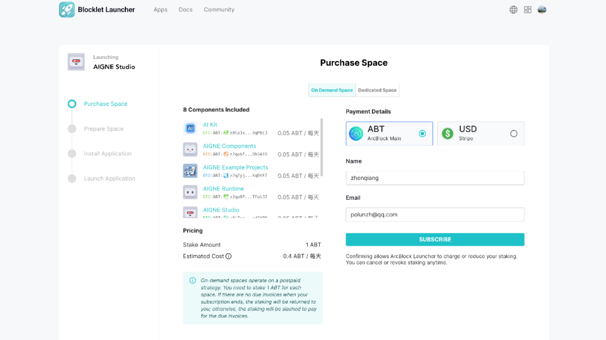
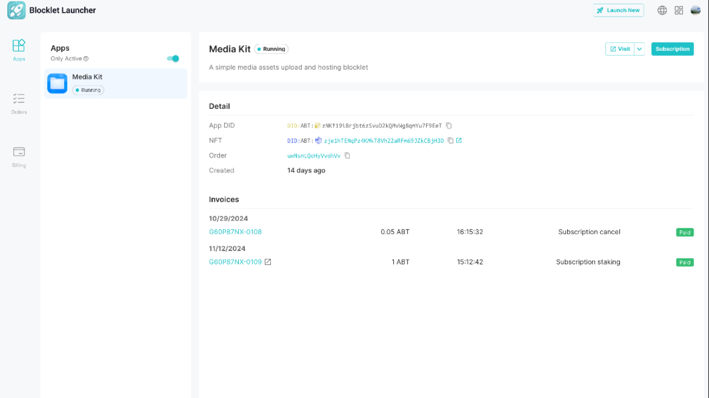
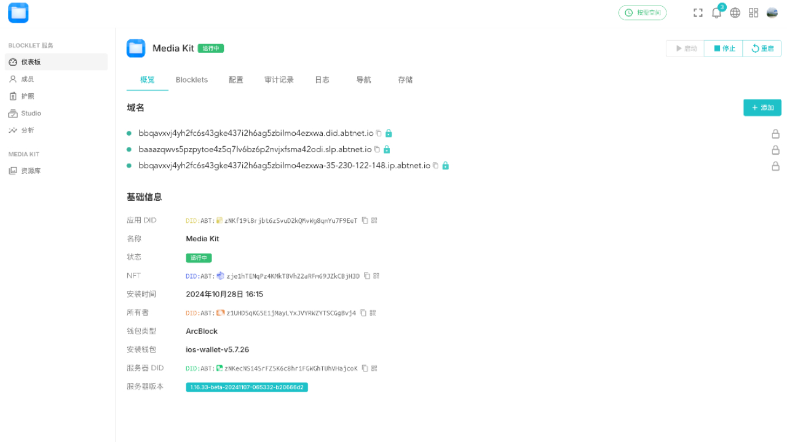

# Blocklet Server Launcher Screenshots

This document provides an overview of the Blocklet Server Launcher application interface through annotated screenshots. The Blocklet Server Launcher helps you manage Blocklet Server instances across cloud providers, handling application deployments, subscriptions, and billing.

## Purchase Space Subscription

This screenshot shows the space purchase flow where users can subscribe to on-demand or dedicated hosting space for their blocklet applications. The interface displays the AIGNE Studio application being launched, with 8 components included in the subscription package (AI Kit, AIGNE Components, Example Projects, Runtime, and Studio). Users can select their preferred payment method (ABT tokens or USD), enter their details, and configure staking amounts. The on-demand pricing model requires 1 ABT stake per space, with automated staking returns when subscriptions end.

## App Details and Invoices

This screenshot displays the application detail page for the Media Kit blocklet in running status. The interface shows comprehensive application information including the App DID, NFT identifier, and order reference. The invoices section lists subscription-related transactions with timestamps, amounts in ABT tokens, and payment status indicators. Users can access the running application via the "Visit" button and manage subscription settings. This view provides transparency into billing history and application metadata for active blocklets.

## App Overview and Domains

This screenshot presents the Chinese-language view of the Media Kit application overview tab, focusing on domain management and basic information. The interface displays configured domain names and DNS records for accessing the deployed blocklet. Key technical details are shown including the application DID, NFT identifier, installation timestamp (October 28, 2024), owner information, blockchain type (ArcBlock), wallet version (ios-wallet-v5.7.26), and consumer DID. The navigation sidebar provides access to different sections like settings, billing, Studio, and analytics for comprehensive application management.
