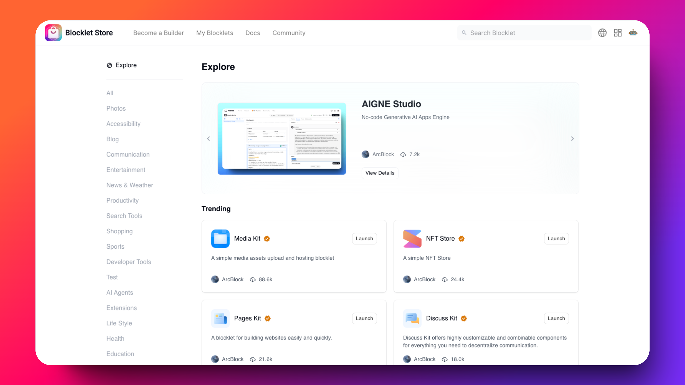
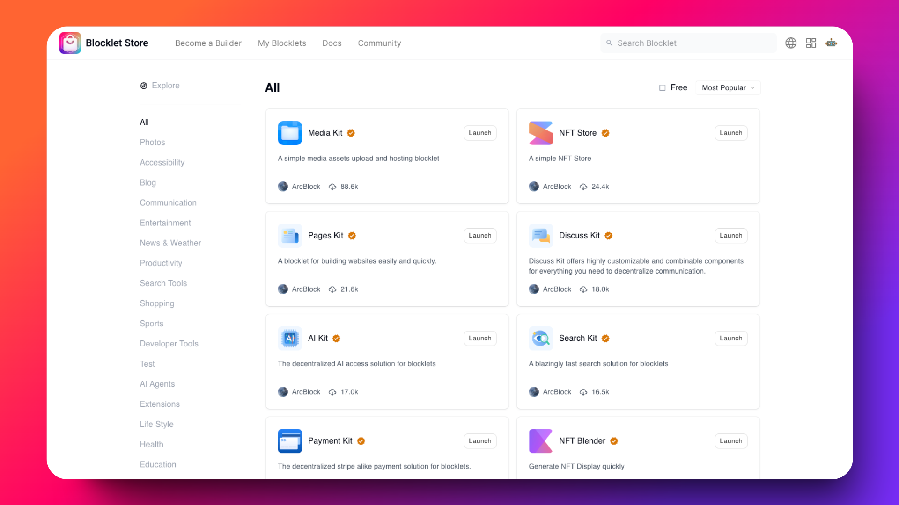
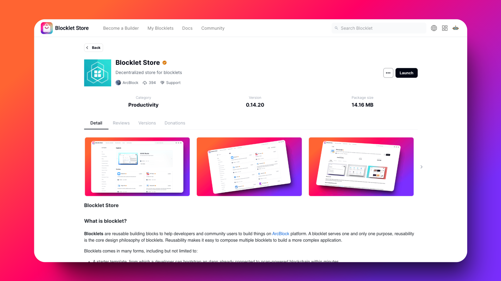
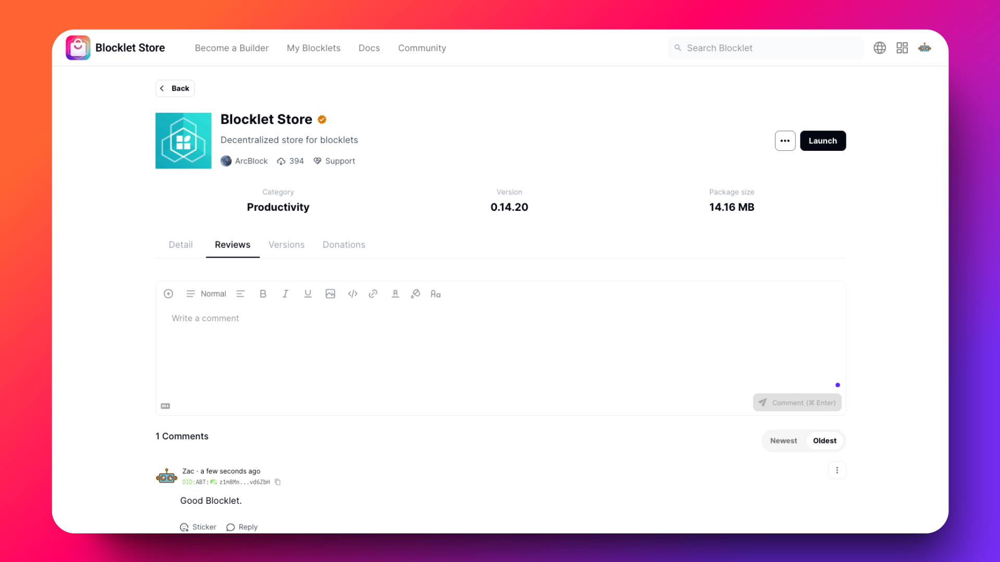
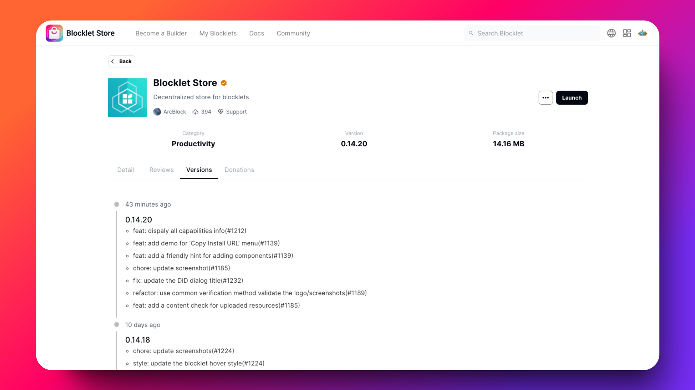

# Blocklet Store Screenshots

This document provides an overview of the Blocklet Store application interface, showcasing key features and functionality through visual examples.

## Explore Trending Blocklets

The Explore page serves as the main discovery interface for the Blocklet Store, featuring a featured carousel highlighting popular blocklets like AIGNE Studio (a no-code generative AI apps engine), and a "Trending" section below showcasing popular blocklets such as Media Kit, NFT Store, Pages Kit, and Discuss Kit. The left sidebar provides category filtering options including Photos, Accessibility, Blog, Communication, Entertainment, News & Weather, Productivity, Search Tools, Shopping, Sports, Developer Tools, and more, enabling users to browse blocklets by specific use cases.

## Blocklet Catalog Grid

The catalog view displays all available blocklets in a clean grid layout, showing each blocklet with its icon, name, verified badge, brief description, publisher information (ArcBlock), and download/usage statistics. Users can filter by free blocklets and sort by "Most Popular" to discover widely-adopted solutions. Featured blocklets include Media Kit (88.6k), NFT Store (24.4k), Pages Kit (21.6k), Discuss Kit (18.0k), AI Kit (17.0k), Search Kit (16.5k), Payment Kit, and NFT Blender, each with a "Launch" button for quick deployment.

## Blocklet Detail Overview

The detail page for the Blocklet Store itself provides comprehensive information including the blocklet's logo, title, description ("Decentralized store for blocklets"), publisher (ArcBlock), download count (394), and support badge. Key metadata is displayed prominently: Category (Productivity), Version (0.14.20), and Package size (14.16 MB). The page features a screenshot carousel showcasing the application's interface, tabs for Detail/Reviews/Versions/Donations, and a detailed "What is blocklet?" section explaining that blocklets are reusable building blocks for developers to build applications on the ArcBlock platform.

## Blocklet Reviews & Comments

The Reviews tab provides a community engagement interface where users can read and write comments about blocklets. It features a rich text editor with formatting options (Normal text, Bold, Italic, Underline, Image, Code, Link, Strike-through, and Color picker) for composing detailed reviews. The comment section displays user feedback with timestamps, DID identifiers, and interaction options including "Sticker" reactions and "Reply" functionality, with sorting options for "Newest" or "Oldest" comments.

## Blocklet Version History

The Versions tab presents a chronological changelog of blocklet releases, showing detailed version information and feature updates. Recent versions displayed include v0.14.20 (43 minutes ago) with features like displaying all capabilities info, adding a "Copy Install URL" menu, friendly component hints, screenshot updates, DID dialog fixes, verification method refactoring, and content checks for uploaded resources. Version 0.14.18 (10 days ago) includes screenshot updates and blocklet hover style improvements. This transparency helps users track development progress and understand what changes and improvements have been made to the blocklet over time.
